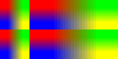
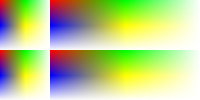

# Consistency

Not all 2D renderers were created equally. There are always performance and quality trade offs to be made - and the heuristics used to choose between the two change over time.

That is to say, although it's NGraphic's goal to create a consistent rendering experience across platforms, it is not perfect and never will be.

This document describes a few of the more notable divergers.

## Image Scaling

The following pictures show a 2x2 pixel image fitted into a larger image 4 times. This is not easy for renderers and we see quite dramatic differences.

1.  Android
1.  iOS
1.  .NET
1.  WinRT

I don't know what .NET (aka System.Drawing, aka GDI+) was smoking before this test, but they have some *interesting* results. In general, .NET is always off by about half a pixel and this test really shows the effect. The team must have chosen is strange fill convention and we're stuck with it for eternity.

The clear winner here in WinRT using Direct2D. It's glorious. Just look at that fade! Not a pixel in sight. Now that's some programmers showing off.

Android does the next most competent job with CoreGraphics in a close third place.

## Text

Oh fonts. Cross platform text rendering is a pain for a variety of reasons:

1. Platforms often have high and mighty ideological opinions on how text *should* be rendered.
1. Text is costly to render so libraries take as many short cuts as they can.
1. Platforms often try to *help* you by automatically scaling things.
1. Fonts, hinting, and kerning vary from platform to platform depending on which back street dealer the vendor bought the font from.

That is to say, I have a lot of excuses for the mess you're about to see:

1.  Android
1.  iOS
1.  .NET
1.  WinRT

There are so many problems with these images:

1. The weights are all different. Android is ascetic (for once), while WinRT is blasting you with black pixels.
2. Vertical alignment is off. The Windows platforms are both significantly higher on the image than the iOS and Android renderers (Android and iOS seem to share a bit of 2D rendering code as their results are often identical). Thanks to the arbitrary API design, we often only know the *height* of a block of text. Ask a typographer what *height* means and they will just shake their head. *Height* is a silly programmer concept that has no reflection on how type is actually laid out. And yet, that's often all we have to work with.
3. Horizontal alignment is off on .NET. Cause, you know, I'm sure they had their reasons.
4. The text size differs. Android's "S" looks like it came from a whole 'nother font than Georgia. (This one could be a bug in NGraphics, I have to check if Android is doing any evil scaling behind the scenes.)
5. Oh the pixels. WinRT trades pixel alignment over accuracy. The result is darker text and noticeable pixels everywhere (look at the bottom of the "G" in "SVG").

