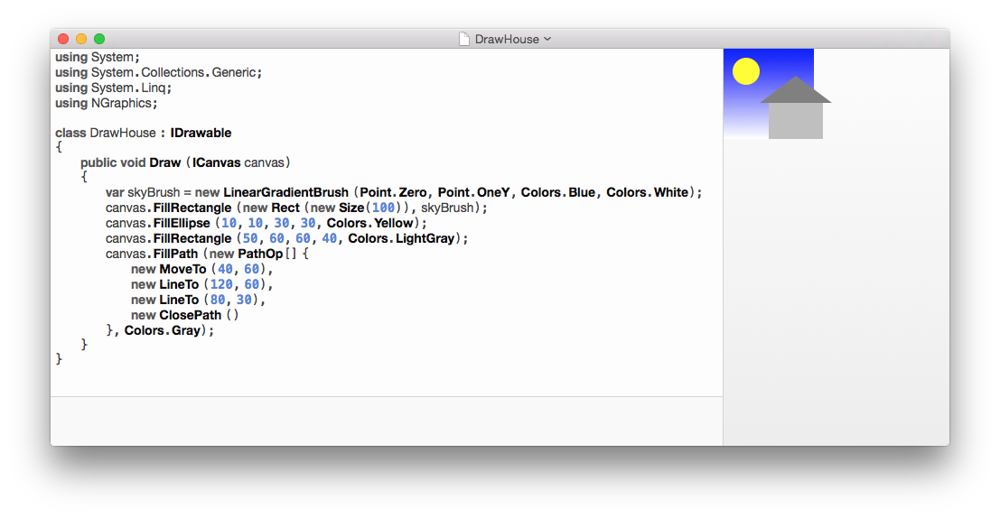
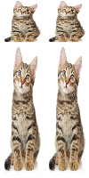

# NGraphics


NGraphics is a cross platform library for rendering vector graphics on .NET. It provides a unified API for both immediate and retained mode graphics using high quality native renderers.

You can use it for cross platform rendering of UI widgets. Or as the basis for graphically rich interactive views. Or maybe you just want an easy way to import and export SVG and PNG files. Either way, I'm sure you'll find something interesting here.


## Installation

[Install NGraphics from nuget](https://www.nuget.org/packages/NGraphics/).


## Getting Started

The most important class is `ICanvas`. Uses canvases to render vector graphics (rectangles, ellipses, paths) to "something". Sometimes canvases are views on the screen, sometimes they are images -- you never really know.

We can draw a little house easily enough:

```csharp
var canvas = Platforms.Current.CreateImageCanvas (new Size (100), scale: 2);

var skyBrush = new LinearGradientBrush (Point.Zero, Point.OneY, Colors.Blue, Colors.White);
canvas.FillRectangle (new Rect (canvas.Size), skyBrush);
canvas.FillEllipse (10, 10, 30, 30, Colors.Yellow);
canvas.FillRectangle (50, 60, 60, 40, Colors.LightGray);
canvas.FillPath (new PathOp[] {	
	new MoveTo (40, 60),
	new LineTo (120, 60),
	new LineTo (80, 30),
	new ClosePath ()
}, Colors.Gray);

canvas.GetImage ().SaveAsPng (GetPath ("Example1.png"));
```


`Platforms.Current.CreateImageCanvas` is just our tricky way to get a platform-specific `ICanvas` that we can rendered on. `IImageCanvases` are special because you can call `GetImage` to get an image of the drawing when you are done. We use a `scale` of 2 to render retina graphics and keep this README looking good.

Paths are drawn using standard turtle graphics.


## Pens and Brushes

When drawing, you have a choice of pens to stroke the object with or brushes to fill it with.

Anyway.

`Pens` can be any *color* and any *width*.

```csharp
var canvas = Platforms.Current.CreateImageCanvas (new Size (120*5, 120), scale: 2);

canvas.Translate (20, 20);
for (var i = 0; i < 5; i++) {
	canvas.DrawEllipse (
		new Rect (new Size (80)),
		pen: Pens.DarkGray.WithWidth (1 << i),
		brush: Brushes.LightGray);
	canvas.Translate (120, 0);
}

canvas.GetImage ().SaveAsPng (GetPath ("PenWidths.png"));
```


`Brushes` can be solid colors or trippy multi-color gradients (linear and radial!)

There is no multi-layering within elements, so you will have to draw them a few times with different brushes to get complex effects.


## Colors

What would a graphics library be without a `Color` class? Well, this one is a struct. Colors are light-weight, have fun with them.

Normally you will use the RGBA constructor of color: `new Color (r, g, b, a)` where each value can range from 0 to 1.

If you're not normal, you might prefer the web notation: `Color.FromRGB (0xBEEFEE)`.


## Retained Mode

Sometimes it's nice to hang onto the graphical elements themselves so that you can change them later, or perhaps cache them from an expensive-to-compute draw operation, or maybe you just want to sing to them. Whatever your needs, NGraphics exposes the following graphical elements:

* `Rectangles` are best used for drawing rectangles.
* `Ellipses` can also be used to draw ovals and circles.
* `Paths` can draw anything that you can imagine, and more. Lines, curves, turtles, they're all for the taking.


```charp
var circle = new Ellipse (new Rectangle (Point.Zero, new Size (10)));

ICanvas canvas = ...;
circle.Draw (canvas);
```

## Platforms


* Android (Xamarin) using Android.Graphics
	- `CanvasCanvas` wraps a `Android.Graphics.Canvas`
* iOS (Xamarin) using CoreGraphics
	- `CGContextCanvas` wraps a `CoreGraphics.CGContext`
* Mac (Xamarin) using CoreGraphics
	- `CGContextCanvas` wraps a `CoreGraphics.CGContext`
* .NET 4.5 using System.Drawing
	- `GraphicsCanvas` wraps a `System.Drawing.Graphics`


## Editor

To speed up the process of drawing with code, NGraphics ships with a code editor and live preview for OS X. [Download the editor from the Releases page.](https://github.com/praeclarum/NGraphics/releases)



Any C# file that can be independently compiled can be used. The advantage of this editor over Xamarin Studio is that you can work on your drawings without having to wait for your whole project to compile and run.

Simply compile and run the project [NGraphics.Editor](https://github.com/praeclarum/NGraphics/tree/master/NGraphics.Editor) or [download the editor](https://github.com/praeclarum/NGraphics/releases) to get started.


## Examples

For more examples, check out the images in the [TestResults directory](https://github.com/praeclarum/NGraphics/tree/master/TestResults)
and the [test code](https://github.com/praeclarum/NGraphics/tree/master/NGraphics.Test) that generated them.

### Icon

The NGraphics icon can be rendered using a simple repeating path:

```csharp
var size = new Size (64);
var canvas = Platforms.Current.CreateImageCanvas (size, scale: 2);
canvas.SaveState ();
canvas.Scale (size);
canvas.Translate (1 / 8.0, 0);

var p = new Path ();
p.MoveTo (0, 1);
p.LineTo (0, 0);
p.LineTo (0.5, 1);
p.LineTo (0.5, 0);

var colors = new [] {
	"#DCDCDD",
	"#C5C3C6",
	"#46494C",
	"#4C5C68",
	"#68A5E2",
};
foreach (var c in colors) {
	p.Pen = new Pen (c, 1 / 4.0);
	p.Draw (canvas);
	canvas.Translate (1 / 16.0, 0);
}

canvas.GetImage ().SaveAsPng (GetPath ("Icon.png"));
```


### Cats

NGraphics also supports scaling cats:

```csharp
var img = GetResourceImage ("cat.png");
var canvas = Platform.CreateImageCanvas (new Size (100, 200), transparency: true);
canvas.DrawImage (img, new Rect (new Size (50)));
canvas.DrawImage (img, new Rect (new Point (50, 0), new Size (50)));
canvas.DrawImage (img, new Rect (new Point (0, 50), new Size (50, 150)));
canvas.DrawImage (img, new Rect (new Point (50, 50), new Size (50, 150)));
canvas.GetImage ().SaveAsPng (GetPath ("ImageCanvas.Cats"));
```




## License

The MIT License (MIT)

See [LICENSE](LICENSE) for details.

