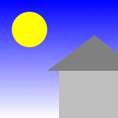
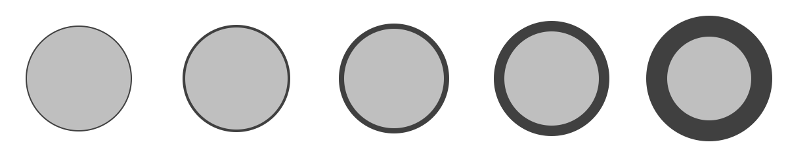

# NGraphics

NGraphics is a cross platform library for rendering vector graphics on .NET. It provides a unified API for both immediate and retained mode rendering using high quality native renderers.

You can use it for cross platform rendering of UI widgets. Or as the basis for graphically rich interactive views. Or maybe you just want an easy way to import and export SVG and PNG files. Either way, I'm sure you'll find something interesting here.


## Installation

Install it from nuget.


## Getting Started

The most important class is `ICanvas`. Uses canvases to render vector graphics (rectangles, ellipses, paths) to "something". Sometimes canvases are views on the screen, sometimes they are images -- you never really know.

We can draw a little house easily enough:

```csharp
var canvas = Platforms.Current.CreateImageCanvas (new Size (100), scale: 2);

canvas.DrawEllipse (10, 20, 30, 30, Pens.Red, Brushes.White);
canvas.DrawRectangle (40, 50, 60, 70, brush: Brushes.Blue);
canvas.DrawPath (new PathOp[] {	
	new MoveTo (100, 100),
	new LineTo (50, 100),
	new LineTo (50, 0),
	new ClosePath ()
}, brush: Brushes.Gray);

canvas.GetImage ().SaveAsPng (GetPath ("Example1.png"));
```



`Platforms.Current.CreateImageCanvas` is just our tricky way to get a platform-specific `ICanvas` that we can rendered on. `IImageCanvases` are special because you can call `GetImage` to get an image of the drawing when you are done. We use a `scale` of 2 to render retina graphics and keep this README looking good.

Paths are drawn using standard turtle graphics.


## Pens and Brushes

When drawing, you have a choice of pens to stroke the object with or brushes to fill it with.

Anyway.

`Pens` can be any *color* and any *width*.

```csharp
var canvas = Platforms.Current.CreateImageCanvas (new Size (120*5, 120), scale: 2);

canvas.Translate (20, 20);
for (var i = 0; i < 5; i++) {
	canvas.DrawEllipse (
		new Rect (new Size (80)),
		pen: Pens.DarkGray.WithWidth (1 << i),
		brush: Brushes.LightGray);
	canvas.Translate (120, 0);
}

canvas.GetImage ().SaveAsPng (GetPath ("PenWidths.png"));
```




`Brushes` can be solid colors or trippy multi-color gradients (linear and radial!)

There is no multi-layering within elements, so you will have to draw them a few times with different brushes to get complex effects.


## Colors

What would a graphics library be without a `Color` class? Well, this one is a struct. Colors are light-weight, have fun with them.

Normally you will use the RGBA constructor of color: `new Color (r, g, b, a)` where each value can range from 0 to 1.

If you're not normal, you might prefer the web notation: `new Color ("#BEEFEE")`.


## Retained Mode

Sometimes it's nice to hang onto the graphical elements themselves so that you can change them later, or perhaps cache them from an expensive-to-compute draw operation, or maybe you just want to sing to them. Whatever your needs, NGraphics exposes the following graphical elements:

* `Rectangles` are best used for drawing rectangles.
* `Ellipses` can also be used to draw ovals and circles.
* `Paths` can draw anything that you can imagine, and more. Lines, curves, turtles, they're all for the taking.


```charp
var circle = new Ellipse (new Rectangle (Point.Zero, new Size (10)));

ICanvas canvas = ...;
circle.Draw (canvas);
```

## Platforms


* iOS (Xamarin) using CoreGraphics
* Mac (Xamarin) using CoreGraphics
* .NET 4.5 using System.Drawing


## License

MIT

