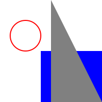

# NGraphics

NGraphics is a cross platform library for rendering vector graphics on .NET. It provides a unified API for both immediate and retained mode rendering to fast and high quality native renderers.


## Installation

Install it from nuget.


## Getting Started

The most important class is `ICanvas`. Uses canvases to render vector graphics (rectangles, ellipses, paths) to "something". Sometimes canvases are views on the screen, sometimes they are images -- you never really know.

We can draw a little house easily enough:

```csharp
var canvas = Platforms.Current.CreateImageCanvas (new Size (100), scale: 2);

canvas.DrawEllipse (10, 20, 30, 30, Pens.Red, Brushes.White);
canvas.DrawRectangle (40, 50, 60, 70, brush: Brushes.Blue);
canvas.DrawPath (new PathOp[] {	
	new MoveTo (100, 100),
	new LineTo (50, 100),
	new LineTo (50, 0),
	new ClosePath ()
}, brush: Brushes.Gray);

canvas.GetImage ().SaveAsPng ("Example1.png");
```



`Platforms.Current.CreateImageCanvas` is just our tricky way to get a platform-specific `ICanvas` that we can rendered on. `IImageCanvases` are special because you can call `GetImage` to get an image of the drawing when you are done. We use a `scale` of 2 to render retina graphics.

Paths are drawn using standard turtle graphics.


## Support


* iOS (Xamarin) using CoreGraphics
* Mac (Xamarin) using CoreGraphics
* .NET 4.5 using System.Drawing


## Retained Mode

```charp
var circle = new Ellipse (new Rectangle (Point.Zero, new Size (10)));

ICanvas canvas = ...;
circle.Draw (canvas);
```